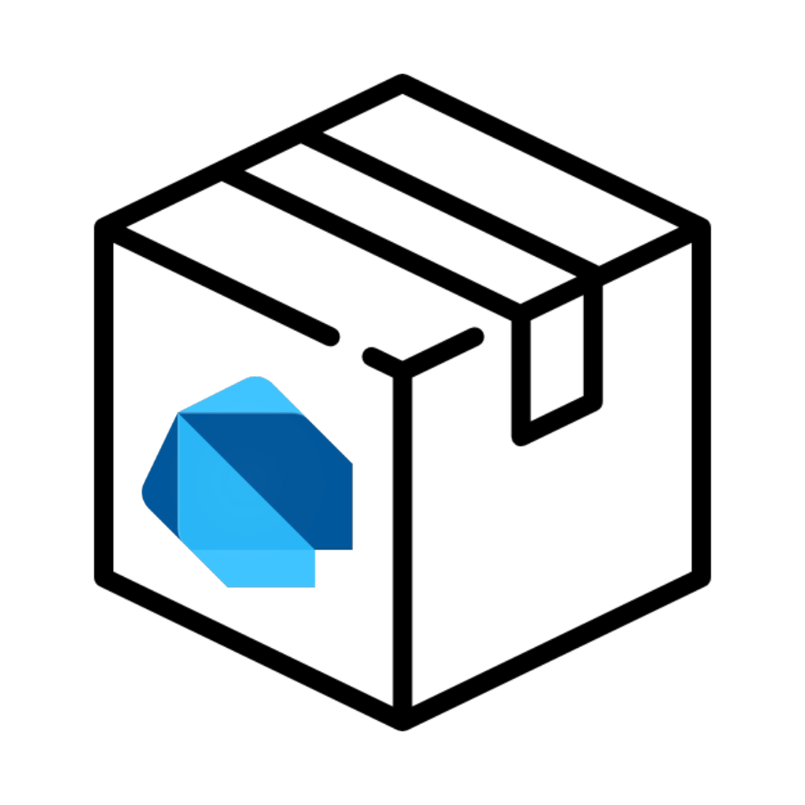

<!-- PROJECT LOGO -->
 

  

  <h3 align="center">Dart Web Server</h3>

  

    A minimal web server in dart
     
  

## Features

- Implemented web server with Dart package [shelf](https://pub.dev/packages/shelf).
- Serving static files with [shelf static](https://pub.dev/packages/shelf_static)
- Implemented example REST APIs.

## Running Server

To run the server
    - clone the project: `git clone https://github.com/sumeetmathpati/dart-web-server.git`
    - Open the downloaded code directory: `cd dart-web-server`
    - Run the app with dart: `dart bin/webserver.dart`

## API Queries

I've implemented some JSON API endpoints, and their examples are given below.

- To get the list of movies:
    - `curl http://localhost:8080/movies/`
- To get the details about specific movie:
    - `curl http://localhost:8080/movies/2`
- To delete the specific movie (in this case delete movie with id = 1):
    - `curl -X DELETE http://localhost:8080/movies/1`
- To add the movie:
    - `curl --header "Content-Type: application/json" --request POST  --data '{"id":4,"title":"The Lord of the Rings: The Fellowship of the Ring","poster":"https://www.themoviedb.org/t/p/w600_and_h900_bestv2/6oom5QYQ2yQTMJIbnvbkBL9cHo6.jpg","year":2001,"trailer":"https://youtu.be/aStYWD25fAQ"}' http://localhost:8080/movies/`# hosted-pub-server
